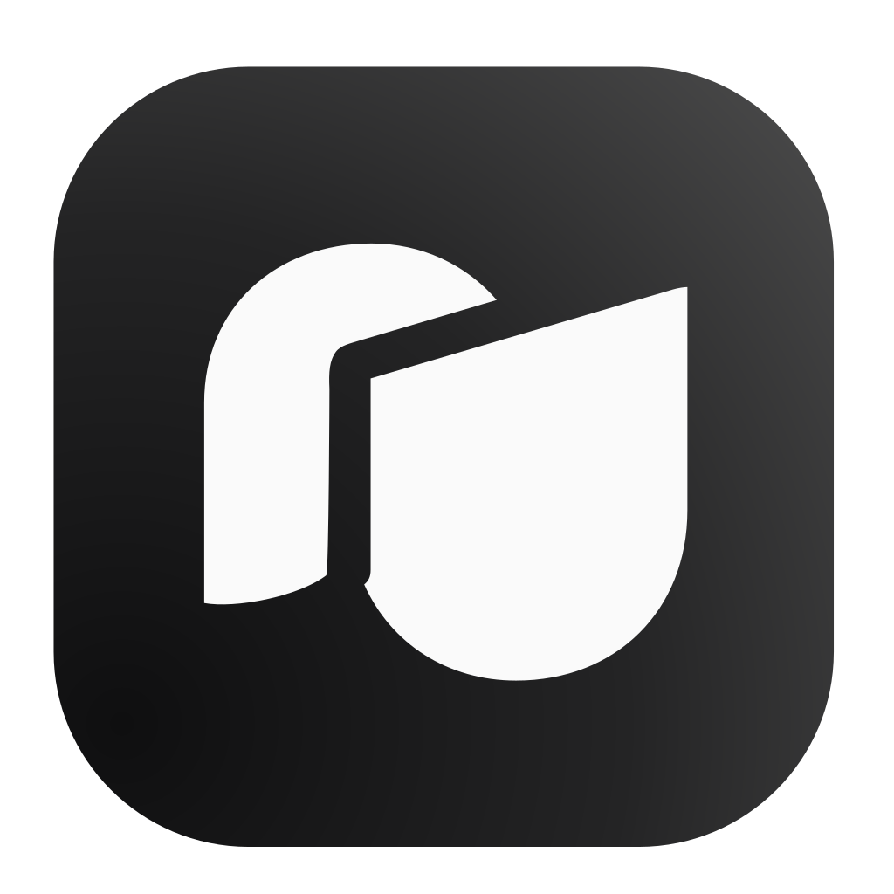

<div align="center">

# NAIS3



**NovelAI Image Studio 3** — NovelAI 이미지 생성을 위한 데스크톱 앱

[](https://discord.gg/bFxP5Qvaz)
[](https://www.patreon.com/c/sunakgo)
[](LICENSE)

</div>

---

> **커스텀 포크 (Custom Fork)** — 이 저장소는 [sunanakgo/NAIS3](https://github.com/sunanakgo/NAIS3)
> **v1.0.12**를 기반으로 한 **비공식 개조판**입니다. 원저작권은 원저작자(sunanakgo)에게 있으며,
> 본 포크는 GPL-3.0에 따라 수정된 소스를 공개합니다. 원본에 추가한 주요 커스텀:
> Custom 1/2 프로필 동시 실행(작업표시줄 아이콘 색 구분), 씬 모드 선별 작업(기준 그림·내장 인페인트·실시간 미리보기),
> 그림체 복구(메타데이터 i2i 일괄 재생성), F5 작업 새로고침(큐·씬 예약 초기화), 이미지 라이브러리 페이지, 수량 직접 입력,
> 그리고 원본 릴리스 자동 업데이트 비활성화. 원본은 활발히 개발 중이므로 `upstream` 리모트로 최신 변경을 반영할 수 있습니다.

---

NAIS3는 NAIS2의 후속작으로, NovelAI 이미지 생성을 빠르고 안정적으로 다룰 수 있게 만든 데스크톱 애플리케이션입니다. 수백 개의 캐릭터·프리셋을 저장하고 수만 장의 이미지를 생성하는 헤비 유저를 염두에 두고 설계했습니다.

## 주요 기능

- **생성** — 텍스트→이미지, i2i, 인페인트. NAI 웹과 바이트 단위로 동일한 payload(시드 일관성) + 실시간 스트리밍 미리보기
- **프롬프트 주석** — 앞 공백을 제외하고 `#`로 시작하는 줄만 전송에서 제외됩니다. `source#`, `target#` 같은 줄 중간 문법은 보존됩니다 (기본·캐릭터·조각 프롬프트 공통, 회색 배경으로 표시)
- **캐릭터 프롬프트** — 라이브러리로 저장·폴더 정리, 위치 지정, 동시 6명까지 활성
- **조각(와일드카드)** — `<이름>`으로 프롬프트에 삽입, 여러 줄 중 랜덤 선택
- **바이브 트랜스퍼 / 캐릭터 레퍼런스** — 이미지 라이브러리로 관리, 인코딩 캐시
- **씬 모드** — 씬별 프롬프트를 미리 저장하고 예약→일괄 생성
- **디렉터 툴** — 배경 제거·라인아트·스케치·색칠·표정 변경·이미지 정리·업스케일
- **메타데이터** — PNG/스텔스 청크에서 프롬프트·파라미터·캐릭터·UC 프리셋·퀄리티 태그 읽기
- **프롬프트 프리셋** — 자주 쓰는 프롬프트+네거티브 저장/불러오기
- **백업** — 라이브러리 전체를 JSON으로 내보내기/불러오기 (NAIS2 백업 가져오기 지원)
- **수동 업데이트** — 커스텀 프로필과 사용자 데이터를 보호하기 위해 앱 자동 교체는 끄고, 커스텀 GitHub Releases에서 설치
- **기타** — 라이트/다크 테마, Anlas 소모 예상 표시, 태그 자동완성(작가 태그 포함), 단축키

## 다운로드

[Releases](https://github.com/seotk0319/NAIS3-Custom/releases/latest)에서 최신 버전을 받으세요.

### 알림 모아보기 · Windows 시작하기

**NAIS3 Custom 1**의 **알림** 탭에서 에덴, 베이비챗, 루나, 엘린, 네코, 티팟, 크랙, 알플레이, 젠잇의 댓글·답글·좋아요·팔로우를 한곳에서 봅니다.

1. 알림 탭 오른쪽 위의 **연결 관리**를 엽니다.
2. 쓰는 플랫폼의 **로그인**을 누르면 Chrome(없으면 Edge) 창이 열립니다. 평소 쓰는 Chrome과 섞이지 않는 NAIS3 전용 창입니다.
3. 그 창에서 사이트에 로그인한 뒤 NAIS3로 돌아와 **로그인 완료**를 누릅니다. 이미 로그인돼 있으면 창이 잠깐 열렸다 저절로 닫힙니다.

그 뒤로는 NAIS3가 직접 알림을 모으고, 대부분의 플랫폼은 로그인도 스스로 이어갑니다. Chrome을 켜둘 필요가 없습니다.
로그인이 풀린 플랫폼에는 **다시 로그인**이 표시됩니다. 체크를 끈 플랫폼은 모으지도, 목록에 보여주지도 않습니다.
로그인 정보는 Windows 사용자 암호로 잠가서, 알림과 함께 각자의 PC에만 저장합니다. Windows x64용입니다.

이전 버전에서 모아 확장 프로그램을 쓰셨다면, 업데이트 뒤 연결 관리에서 플랫폼마다 **로그인**을 한 번씩 눌러주세요.
모아둔 알림은 그대로 남고, Chrome의 모아 확장은 지워도 됩니다.

알림 수집 엔진과 회귀 검사는 `src/main/notifications`와 `tests/engine.test.mjs`에 있고, `npm test`가 함께 실행합니다.

## 기술 스택

- [Electron](https://www.electronjs.org/) + [electron-vite](https://electron-vite.org/)
- [React](https://react.dev/) 19 + [TypeScript](https://www.typescriptlang.org/)
- [Tailwind CSS](https://tailwindcss.com/) v4
- [better-sqlite3](https://github.com/WiseLibs/better-sqlite3) (로컬 DB) · [Zustand](https://github.com/pmndrs/zustand) · [sharp](https://sharp.pixelplumbing.com/)

## 개발

```bash
npm install      # 의존성 설치
npm run dev      # 개발 모드 실행
npm run build    # 타입체크 + 빌드
npm test         # 테스트

# 패키징
npm run build:mac    # macOS (.dmg)
npm run build:win    # Windows (.exe)
```

## 문의 · 후원

- 💬 **Discord**: <https://discord.gg/bFxP5Qvaz>
- ❤️ **Patreon**: <https://www.patreon.com/c/sunakgo>

## Thanks to

NovelAI API 동작을 이해하는 데 아래 프로젝트들을 참고했습니다.

- **SDStudio**
- **NAIA 2.0**

## 라이선스

이 프로젝트는 [GNU General Public License v3.0](LICENSE) 하에 배포됩니다.
